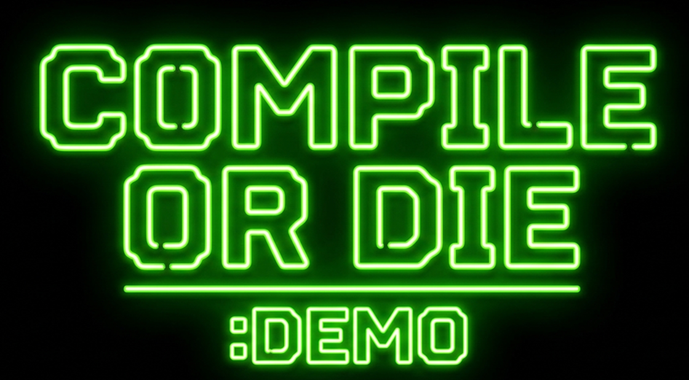
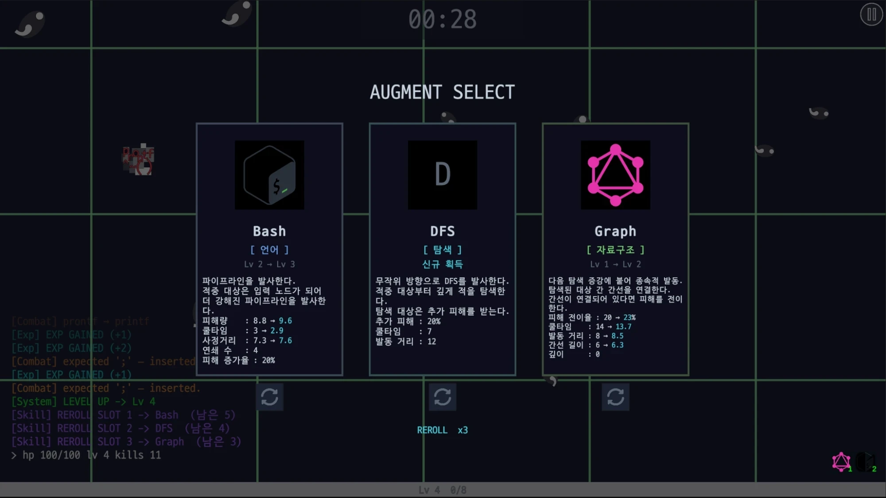

<div align="center">



**컴파일에 실패하면, 죽는다**

프로그래밍 언어, 알고리즘, 자료구조를 무기로 조합해
코드에서 기어 나오는 에러와 버그를 정리하는 2D 로그라이크 서바이벌


</div>

---

## 게임 소개

플레이어는 컴파일에 실패한 소스 코드에 붙은 디버거 프로세스입니다.

```
$ gcc -o stage_01 main.c
> compiling ...
> ERROR: 2,138 issues found
> attaching debugger : PLAYER_01
```

터미널 위로 세미콜론 누락, 오타(`prontf`), 미해결 warning, 데드락 같은 컴파일 에러들이
몬스터가 되어 사방에서 몰려옵니다.

직접 공격하는 조작은 없습니다. 대신 레벨업할 때마다 **증강(Augment)** 을 골라 무기를 조립합니다.
증강은 프로그래밍 언어(`Bash`, `C`), 알고리즘(`DFS`, `BFS`, `LinearSearch`, `BruteForce`),
자료구조(`Graph`, `Tree`)에서 가져왔고, 개념이 그대로 전투 메커닉이 됩니다.
탐색 계열이 적에게 표식을 남기면 `Graph`가 그 사이에 간선을 이어 피해를 전이하고,
`Tree`는 루트가 맞은 피해를 자식 노드로 흘려보내는 식입니다.

3분을 버티면 최종 보스 **BlueScreen**이 화면을 점거합니다. 이걸 잡아야 컴파일이 끝납니다.

**특징**

- **자동 전투** / 조작은 이동뿐이고, 무엇을 고르고 어떻게 조합하는지가 실력
- **3분 단위 런** / 60초씩 3파로 밀도가 올라가다가 180초에 보스 등장
- **런 사이 성장** / 런에서 번 `bit`로 PC 부품을 올려 다음 런을 유리하게 시작

<br>

## 스크린샷

<div align="center">



**증강 선택** / 레벨업마다 3장 중 하나를 고름
카드에 분류(언어, 탐색, 자료구조)와 레벨 변화, 수치 증감이 뜨고 슬롯마다 리롤 가능
왼쪽 아래는 처치와 레벨업이 실시간으로 흐르는 컴파일 로그창

</div>

<br>

## 하드웨어 업그레이드

런에서 번 `bit`로 PC 부품을 사서 영구히 강해집니다.
구매 레벨과 적용 레벨을 따로 관리해서, 산 것을 잃지 않으면서 낮은 세팅으로도 시험해 볼 수 있습니다.

| 부품 | 올려주는 것 |
|---|---|
| **CPU** | 쿨타임 감소 |
| **RAM** | 투사체 수 증가 |
| **SSD** | 경험치 획득 범위 |
| **GPU** | 공격(효과) 범위 |
| **POWER** | 전체 공격력 |
| **MONITOR** | 시야 범위 |
| **MOUSE** | 사정거리 |
| **KEYBOARD** | 이동 속도 |
| **MAINBOARD** | 런 시작 시 증강 선택 횟수 |
| **COOLER** | 최대 체력 |

<br>

## 기술 스택

| | |
|---|---|
| **엔진** | Unity `6000.4.0f1` (Unity 6) |
| **렌더링** | Universal Render Pipeline `17.4.0` |
| **입력** | Input System `1.19.0` |
| **카메라** | Cinemachine `3.1.6` |
| **UI** | uGUI + TextMeshPro (D2Coding) |
| **언어** | C# |

**설계 원칙**

- **씬은 하나** / 스테이지와 캐릭터를 바꾸는 건 `ScriptableObject`를 갈아끼우는 일. 씬을 복제하면 버그 하나를 고칠 때마다 모든 사본을 똑같이 고쳐야 함
- **수치는 씬에 두지 않음** / 체력, 이동속도, 시작 증강은 전부 데이터 에셋에 있음
- **증강은 모듈 조립** / 트리거 → 타겟팅 → 전달 → 효과 4축을 갈아끼워 무기를 만듦. 새 무기를 위해 새 클래스를 쓰지 않음
- **풀링** / 투사체, 이펙트, 적은 `PoolManager`가 재사용

<br>

## 프로젝트 구조

```
Assets/_Project/
├── Art/           스프라이트, 애니메이션, 폰트, 오디오, 아이콘
├── Data/          ScriptableObject 원본 (밸런스 시트 역할)
│   ├── Augment_Data/     증강 10종 + 내부 증강 3종 + 아이템 3종
│   ├── Character_Data/   BASH, Zsh, CMD
│   ├── Enemy_Data/       에러 몬스터 8종 + 보스 + 데이터 박스
│   ├── Stage_Data/       웨이브, 보스 스케줄, 정산 계수
│   └── Progress_Data/    하드웨어 업그레이드 표
├── Prefabs/       플레이어, 적, 증강, VFX, UI
├── Scenes/        MainA(로비), MainB, Run(인게임), StageResult(정산)
├── Editor/        증강 에디터 도구
└── Scripts/
    ├── Augment/   증강 모듈 4축, 파이프라인, 드래프트, 연출
    ├── Combat/    피해 파이프라인, 상태이상, 표식, 링크
    ├── Core/      GameManager, LevelSystem, PoolManager, TimeControl
    ├── Enemy/     적 AI, 세미콜론 캐스터, 데드락 사이클, 블루스크린
    ├── Player/    이동, 체력, 스캐너, 피격 피드백
    ├── Progress/  하드웨어 업그레이드, 세이브(PlayerPrefs)
    ├── Run/       런 디렉터, 보스 스폰, 결과 정산
    ├── Stage/     스포너, 웨이브, 배경 리포지션
    └── UI/        HUD, 증강 선택, 로그창, 상점, 설정
```

<br>

## 실행 방법

```bash
git clone https://github.com/MAV-Team5/Compile_or_Die.git
```

1. Unity Hub에서 `Unity 6000.4.0f1`로 프로젝트를 엽니다
2. `Assets/_Project/Scenes/MainA.unity`를 열고 재생합니다

> 에디터 버전이 다르면 URP 셰이더와 TextMeshPro 에셋이 깨질 수 있습니다.

<br>

## 개발 컨벤션

**브랜치**

```
main               안정 버전
└── develop        통합 테스트
    └── feature/*  작업 브랜치
```

1. `develop`에서 브랜치 생성
2. `feature/*`에서 작업
3. `develop`으로 Pull Request
4. 테스트 후 `main`으로 머지

**커밋 접두어**

| 접두어 | 용도 |
|---|---|
| `[Add]` | 기능 추가 |
| `[Fix]` | 버그 수정 |
| `[Refactor]` | 코드 정리 |
| `[Remove]` | 삭제 |

문제가 생기면 팀원들과 공유하고 해결합니다.

<br>

## 팀 - MAV Team 5

- [@Oreo-Hyeon](https://github.com/Oreo-Hyeon)
- [@Curamy](https://github.com/Curamy)
- [@SUNGHYUN-choi7192](https://github.com/SUNGHYUN-choi7192)
- [@wannabeadirector](https://github.com/wannabeadirector)
- [@subin-software](https://github.com/subin-software)
